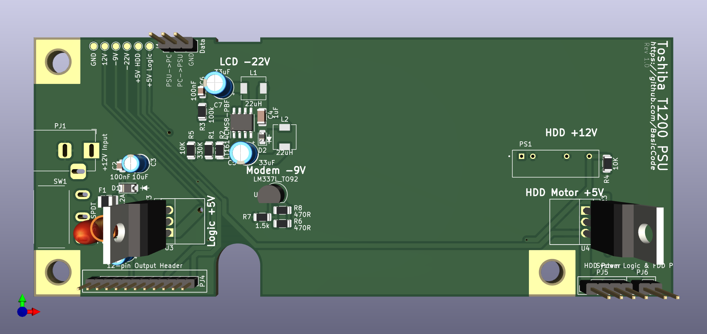
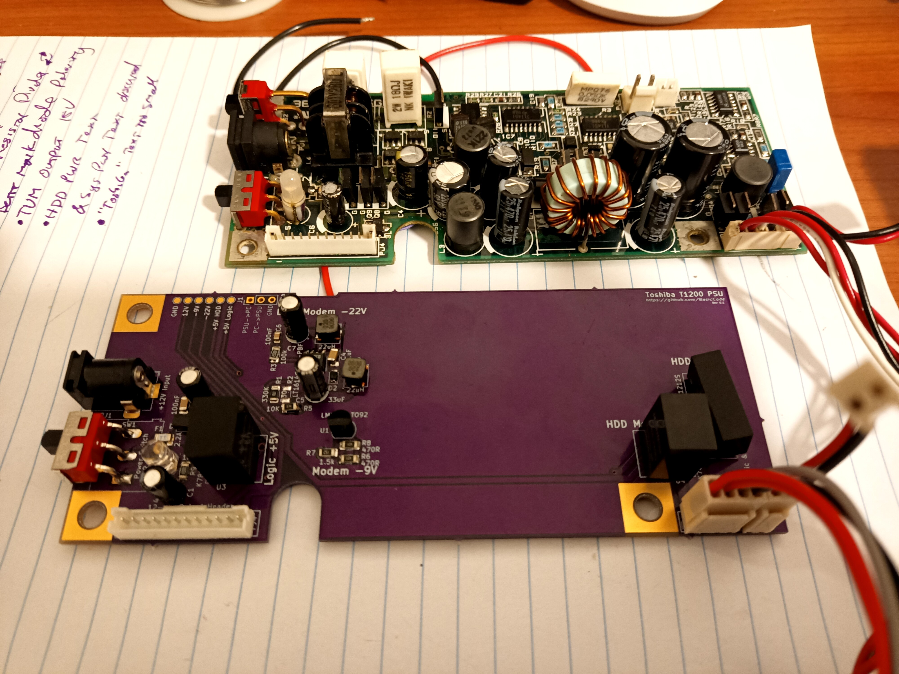
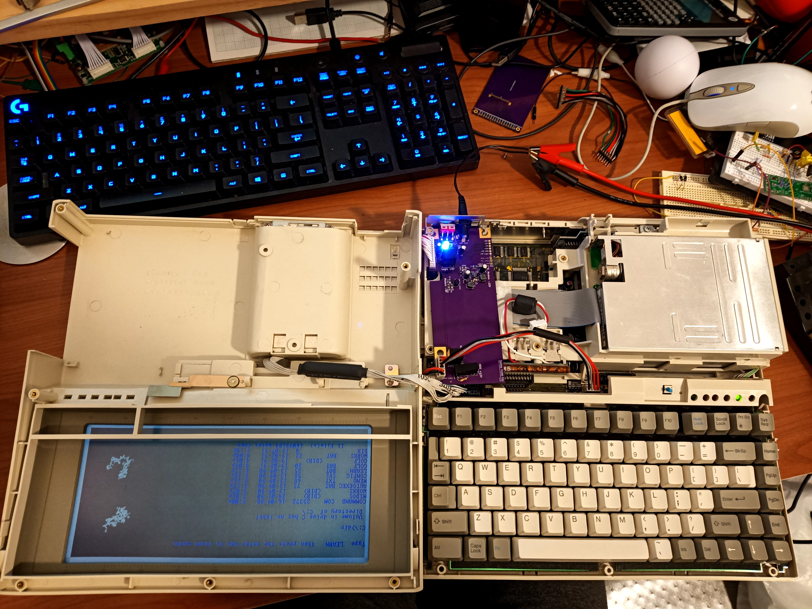

# Toshiba-T1200-PSU
A replacement power supply design for the Toshiba T1200 laptop computer from 1987. The Toshiba T1xxx series are notorious for power supply falures, and the power supply design is complex for the era. While the complicated design did allow for some innovative new power management features for the time, it also allowed for a myriad of annoying failure modes. I say this only because I have not implemented most of the auxiliary features here, but they may be desirable in the future. 
 
This is revision one, it has the basic requirements to make the machine boot but it lacking any of the extra features of the original supply. **Also, please read the note about input / output protection**. I have used modular power options where possible and have tried to follow the recommended design for the -22V SMPS circuit as closely as possible. Please feel free to improve on this design.

## Getting Started
This board is designed in KiCad 6.x, custom and third-party footprints are included in the repository, and the individual Gerber files are included.
* Parts list for DigiKey is available in the (Toshiba T1200 Power Supply.xlsx "Toshiba T1200 Power Supply.xlsx") file. All of the passives are generic and can be replaced with whatever you have laying around, just take care to use low ESR 33uF caps for the -22V SMPS. Two parts are missing from the list; the female headers for the interconnect between the PSU and the Motherboard. They are generic keyed headers like these: (https://www.jaycar.com.au/4-pin-0-1-header-with-crimp-pins-2-54-pitch/p/HM3404), (https://www.jaycar.com.au/2-pin-0-1-header-with-crimp-pins-2-54-pitch/p/HM3402).
* The board is designed to use 12V, like the original, however the invdividual switchmode supplies have different tollerances so you might be able to get away with other supplies but check the datasheets first.
* I used OSH Park to print the boards (https://oshpark.com/shared_projects/8MR7H5RI).
* The footprint for the DC Barrel Jack 12V input *should* fit the jack on the original PCB if you want to use that, however I have used a more standard size plug and a modern, off-the-shelf, 12V plug pack. The original power supply is rated for 2.2A.
* I measured the whole system at boot to draw approx. 700mA at 12V.
* There is NO output protection, so if you build one of these then make sure to check the voltage rails before using it.

## Notes About Input / Output Protection
Basic input protection is included in the design, and there is some protection inherent to the individual SMPS controllers, however there are further considerations that should be made in future designs.
* D1 should be sufficient to supply enough current to blow the 2.2A fuse. The details of D1 are not specified in the schematic.
* Clamping diodes should be added to the outputs. Especially the negative voltage rails which will become positive if D2 fails.
* Over-current protection of the outputs is provided by the individual switchmode controllers.
* Over-voltage protection for the inputs is a consideration, however the individual switchmode supplies affort some protection in this regard.

## TODO
These things would be nice to fix in the next revision.
* Create a public Digikey or Mouser parts list. - Turns out DigiKey don't do a public list.

## Future Options
Although I don't plan to implement these features, I've tried to design the circuit with them in mind.
* HDD Power switch.
* Arduino-compatable system to interact with the TX/RX lines.
* LiPo charging, and boost circuit to run off one or two 18650s, OR NiCad.

## Thanks and References
Thanks to these forums for helping sole so many problems:
* https://forum.vcfed.org/index.php?threads/toshiba-t1200-internal-power-supply-issues.72126/
* https://forum.vcfed.org/index.php?threads/toshiba-t1200-psu-pinout.1216344/
* http://www.minuszerodegrees.net/manuals/Toshiba/Other/Toshiba%20T1200%20-%20Maintenance%20Manual.pdf

## Fixed in Rev. 1.0
* Cleaned up custom footprit assets folder.
* DC barrel jack placement.
* TMV1212S open circuit voltage too high. Added load resistor.
* TMV1212S corrected footprint.
* PWR_SW corrected footprint.
* "Toshiba T1200 PSU" text moved.
* Text for PJ5 and PJ6 updated.
* Symbols added to D1, D2.
* C6 and C2 are now the same footprint.