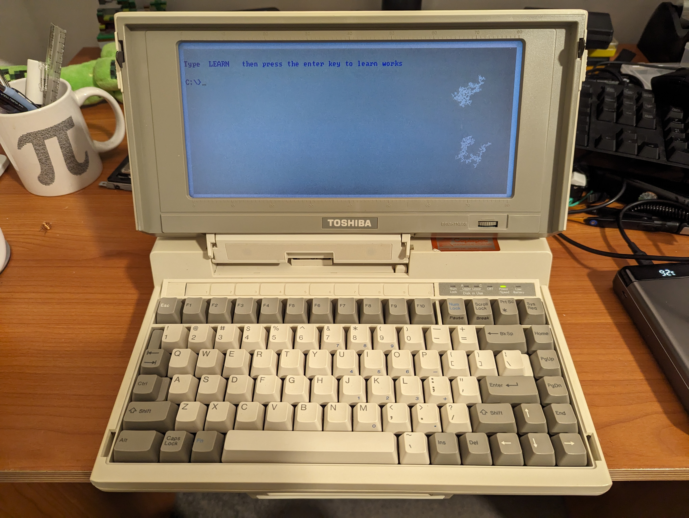
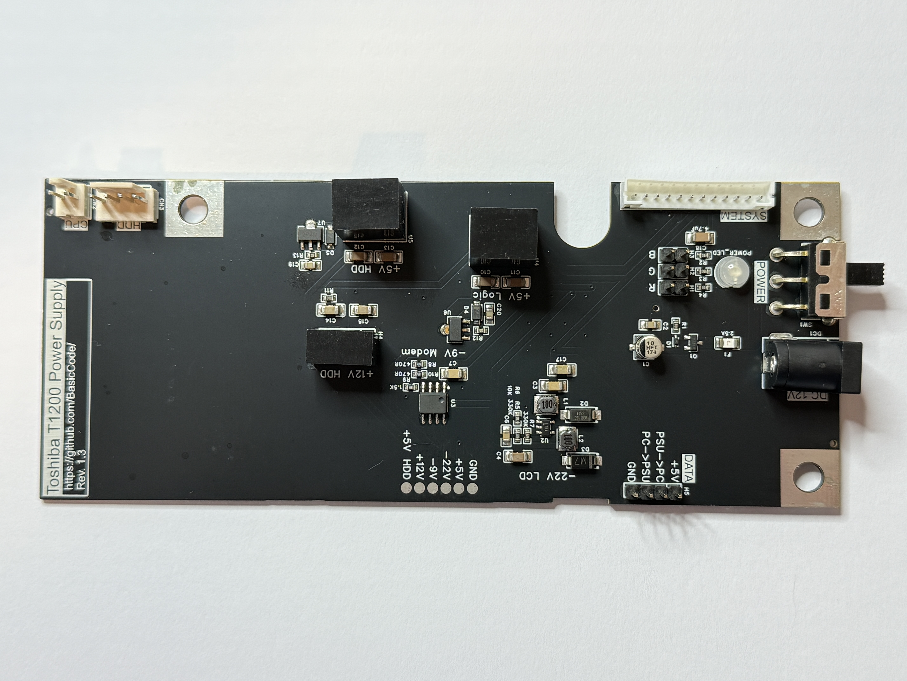
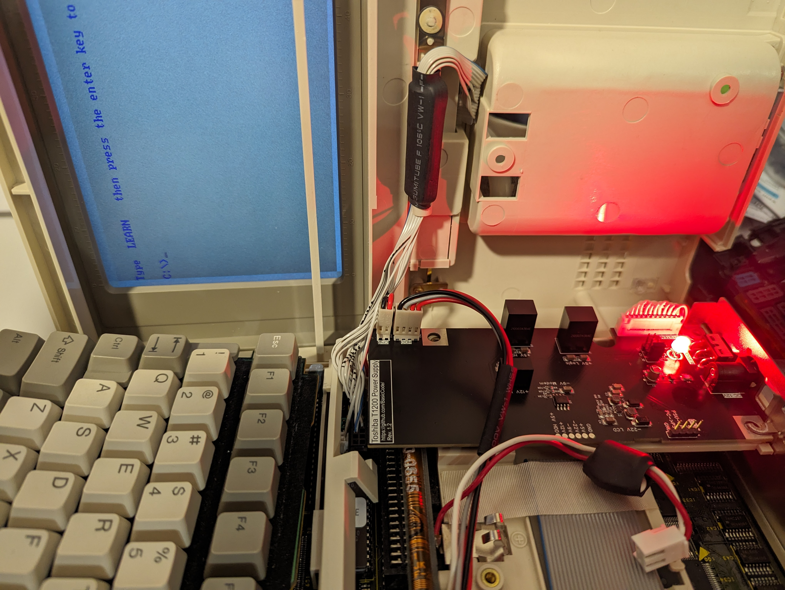
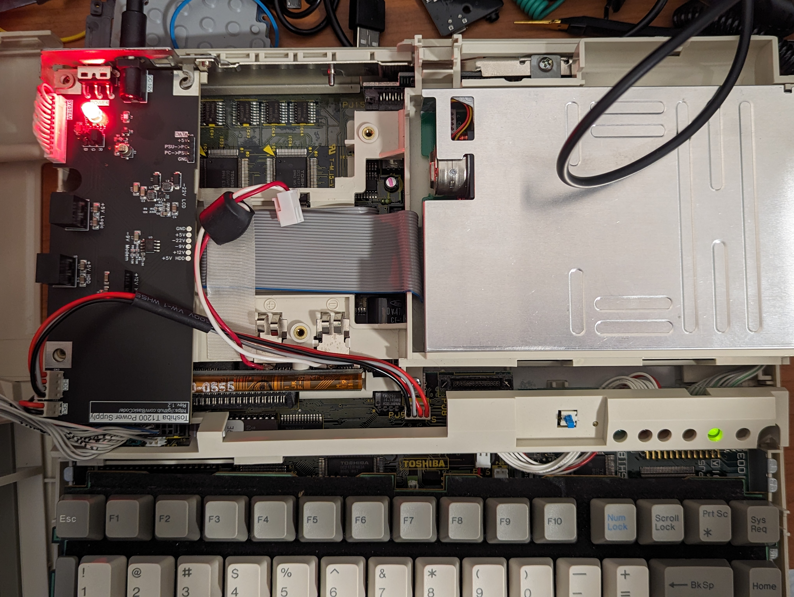

# Toshiba-T1200-PSU

A replacement power supply design for the Toshiba T1200 laptop computer from 1987. The Toshiba T1xxx series are notorious for power supply falures, and the power supply design is complex for the era. While the complicated design did allow for some innovative new power management features for the time, it also allowed for a myriad of annoying failure modes. I say this only because I have not implemented most of the auxiliary features here, but they may be desirable in the future. 
  
This is a drop-in replacement board which has the bare necessities to allow the machine to boot. It does not support the "advanced" features like HDD power management, battery charging, or even battery power supply. It provides two +5V rails, a +12V rail for the HDD, a -22V rail for the LCD, and also a -9V rail for the RS232 modem. Most of these are provided by off-the-shelf modules, however some parts had to be designed specifically for this purpose. The CPU data communication lines are also broken out to a header for anybody who would like to go down that rabbit hole; let me know how you go.
  
**NOTE:** While I have tried to design a safe system, and tested it using my own personal device as well as relevant test equipment, **I am only a hobbyist** and I strongly encourage you to make your own assessment of the quality of this device.
  
* [JLCPCB Project](https://oshwlab.com/tommy_tom2000/toshiba-t1200-power-supply-v1-3)
* [Buy on Tindie](https://www.tindie.com/products/basiccode/toshiba-t1200-power-supply/)

## Getting Started
The board is designed to be manufactured by JLCPCB using parts from LCSC. The full project is free to use and modify, and available [here](https://oshwlab.com/tommy_tom2000/toshiba-t1200-power-supply-v1-3). The Gerber and BoM files are provided here for those who do not want to use JLCPCB. The previous version of this project was more friendly for hand-soldering is also still available in [past commits](https://github.com/BasicCode/Toshiba-T1200-PSU/commit/b5f09ac5c124c712909910e9a37de9bca65d9860).

  
Some traces of power rail noise are included in the *images* directory. Ripple for the -22V and -9V rails were below the noise floor of my work bench and so have not been included.

## TODO and Errors
* Create a video or page to document the install process.
* 300mV ripple on the 12V rail under load, and a -1V spike when full load is applied. A clamping diode might be useful in a future revision.

## Thanks and References
Thanks to these forums for helping sole so many problems:
* https://forum.vcfed.org/index.php?threads/toshiba-t1200-internal-power-supply-issues.72126/
* https://forum.vcfed.org/index.php?threads/toshiba-t1200-psu-pinout.1216344/
* http://www.minuszerodegrees.net/manuals/Toshiba/Other/Toshiba%20T1200%20-%20Maintenance%20Manual.pdf